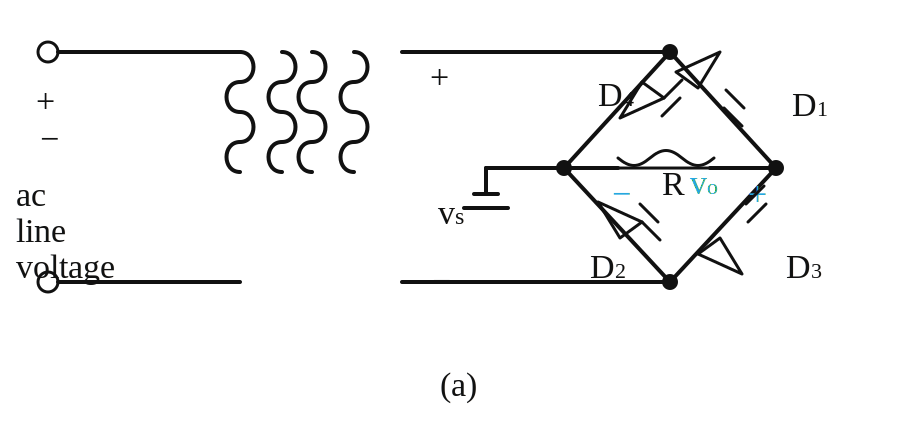

# Baseline Solution 3 — Agent Circuit Benchmark

## Overview

Each section below records one agent's analysis of a circuit schematic image.
For each circuit the agent produced:
- A Falstad interactive simulation link reconstructed from the image.
- An LTSpice-compatible `.cir` netlist saved under `baseline-solution/simulations/`.

Agents are identified by model name. Multiple agents may analyse the same circuit;
their entries appear as separate subsections under the same circuit heading.

---

## Circuit 01 — Full-Wave Bridge Rectifier

### Agent: codex

**Circuit description:** This schematic is a transformer-isolated full-wave bridge rectifier feeding a resistive load. The secondary winding drives four diodes in a bridge so that current through the load resistor always flows in the same direction, producing a pulsating DC output across `R`. The top and bottom halves of the AC waveform conduct through alternate diode pairs, so the ripple frequency at the output is twice the supply frequency.

**Component count:** 6 components

**Falstad simulation:** [Open in Falstad](https://www.falstad.com/circuit/circuitjs.html#eNp1jzkOwzAMBHu-You0FkiaYuTnGLCdJlWQ4_sRLVtVAhUrzCx1XCDI6-AQTorMyLAxiAi94QYTj5hqAxwF8TRd67aulOlzSDWO4AZiKEgk03La0QtUDYpl3ebX_XmoqP1yItpYG_-n9tu6e_Sjzk59MzPTrYM9S4kv0BcjOTUp)

**LTSpice netlist:** [`simulations/01-codex-full-wave-bridge-rectifier.cir`](simulations/01-codex-full-wave-bridge-rectifier.cir)

> **Notes:** The source image does not label the transformer turns ratio, diode part number, or load value. Falstad and SPICE therefore use a representative isolated 12 Vrms secondary, generic 1N4007-class silicon diodes, and a 1 kOhm load.

### Agent: claude-sonnet-4-6

**Circuit description:** An AC line voltage is stepped down by a transformer whose secondary output (v_S) feeds a full-wave bridge of four diodes (D1–D4). During the positive half-cycle D1 and D3 conduct, and during the negative half-cycle D2 and D4 conduct; in both cases current flows in the same direction through the load resistor R, producing a full-wave rectified DC output v_O. The circuit delivers unsmoothed (pulsating) DC at twice the supply frequency with a peak equal to the transformer secondary peak minus two diode forward-voltage drops.

**Component count:** 6 components (transformer/AC source, D1, D2, D3, D4, R)

**Falstad simulation:** [Open in Falstad](https://www.falstad.com/circuit/circuitjs.html#eNp1jzsOwzAMQ3efgkPXBPpYqn2cAkmzdCr6uX6tOvHUThT4KIE6gWHr5GCaXbP42bQWdjODEQxZgzOnF6pDTULYCdQ2m7AgZpotvQ8kpfRIt2IprFBKy8BaMsQcgmW9Xp63x84i94txle7tmX_sW2Gw-2DHzVaaiNI2QKhSjjfSB6QiOMo)

**LTSpice netlist:** [`simulations/01-claude-sonnet-4-6-full-wave-bridge-rectifier.cir`](simulations/01-claude-sonnet-4-6-full-wave-bridge-rectifier.cir)

> **Notes:** Transformer modelled as an ideal sinusoidal voltage source (12 V peak, 60 Hz); no magnetising inductance or leakage. Load R assumed 1 kΩ (value not specified in schematic). Diodes modelled as 1N4001 in both Falstad and LTSpice.

### Agent: gemini-2.0-flash

**Circuit description:** A full-wave bridge rectifier using four diodes (D1–D4) to convert an AC input voltage from a transformer secondary into a unipolar pulsating DC voltage across a load resistor R. The circuit ensures that current flows through the load in the same direction during both half-cycles of the AC input.

**Component count:** 6 components (1 AC Source/Transformer, 4 Diodes, 1 Resistor)

**Falstad simulation:** [Open in Falstad](https://www.falstad.com/circuit/circuitjs.html#eNp1j7EOwjAMRPd8xQ2sVGcnDv0dpBYWJgT094lNExZQpJx1zz4nBwhsPVYIJ4URhpLdEUkviM7ILKFSCti6a7tORJzJ0jagWv007Z4PuufKtAyelZgJxbJezs_bY0fe9gO5pfpN_8di22BbjyoMYbr30sWH2jdIf2s3emirN6UOfeme8Aal6TjZ)

**LTSpice netlist:** [`simulations/01-gemini-2.0-flash-bridge-rectifier.cir`](simulations/01-gemini-2.0-flash-bridge-rectifier.cir)

> **Notes:** Transformer simplified to an AC voltage source (170V peak, 60Hz) in both Falstad and SPICE models. Load resistor assumed 1 kΩ.

---
